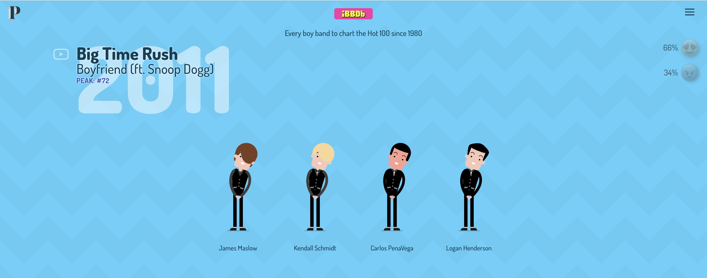

readme.md
# Internet boy band data base  

**Internet boy band data base** es una webstory de *ThePudding* la cual de manera audiovisual nos muestra todas las boybands que desde los años 80’s han entrado al “Billboard Hot 100”  

A través de una página interactiva nos hace hacer una travesía que empieza con *Musical Youth* en 1983, y termina con *BTS* en 2017  

En un llamativo fondo de color azul celeste nos induce al mundo de la música, en donde no solamente nos dicen los nombres de las bandas, sino que mientras escuchamos las canciones de fondo, podemos bailar y disfrutar junto a las animaciones de los chicos que nos hacen revivir sus conciertos  

Desde diferentes accesorios, atuendos personales o cabellos coloridos, que nos hacen reconocer a los chicos, nos ayuda a entrar en esta narrativa la cual va más allá de la música, es un viaje a través de las épocas.  

## La interactividad en esta webstory también esta…  

Siguiendo la línea visual desde la izquierda a la derecha, lo primero que logramos apreciar es que; al lado de los nombres de las bandas, de los títulos de las canciones y su puesto en el ranking, encontramos un **hiper vinculo** para casi todas las canciones en YouTube  

Así siguiendo con todo el costado derecho, en donde encontraremos:  

1. **El conjunto de 3 barritas** el cual nos cuenta el cómo recolectaron la información, los encargados de la las animaciones y redacción, y lo más importante… una **playlist de Spotify** (la cual volveremos al final de esto)  

   Para recolectar la información se basaron en **5 sitios web**:  

   En los cuales se realizan **Rankin** y análisis de estas mismas bandas pudiendo así llegar a esta línea del tiempo.  

2.  Más abajo nos encontramos con un conjunto de **2 emojis** listos para expresar nuestra opinión:  
   - 😍 *Carita con corazones* para tirar corazones morados.  
   - 😡 *Carita molesta roja* para poder lanzar caca.  

   Así mostrándonos el **% de personas que votan igual o encontrar de nosotros**  

3. **Y, por último**, esquina inferior derecha, encontramos el **listado de las bandas acomodadas en orden alfabético**, de esta manera pudiendo llegar de manera más rápida a nuestra banda favorita  

## Reflexión final  

La estructura que presentaron hizo que la manera de contar la historia se volviera altamente creativa, pero considero que el haber puesto información extra, como; historias de las bandas, algún análisis de las canciones, o de la opinión de la fanaticada, hubieran logrado ser una gran adición, la cual nos ayudarían a poder entrar mejor en este mundo que nos ofrecen.  

Pero la verdad es que tal vez no estén todos los datos necesarios para esto, incluyendo la pregunta de **¿Qué es siquiera una boyband?**  

El trabajado de *ThePudding* no fue solamente hacer esta database con las canciones más conocidas de las boybands, sino que incluyeron un **link para una playlist de Spotify** de las bandas… pero parece que alguien hizo una nueva adición a esta lista  

Considero que **todas las bandas estarían orgullosas de estar aquí… o casi todas** 

[def]: imagen1